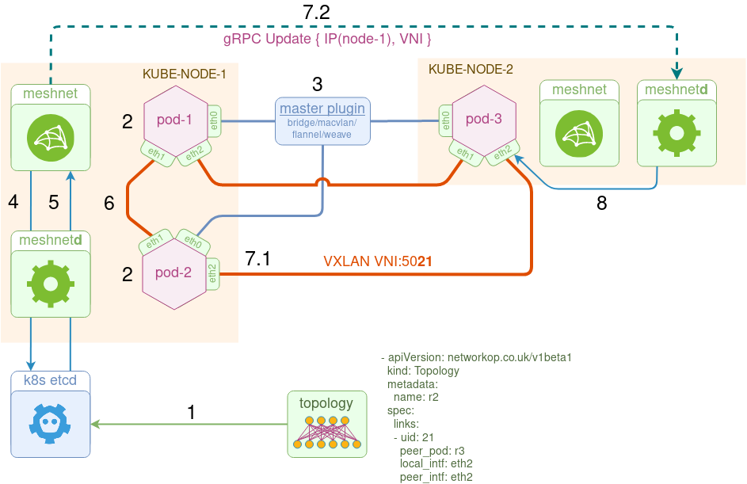

[](https://github.com/networkop/meshnet-cni/actions)
[](https://img.shields.io/docker/pulls/networkop/meshnet)
[](https://goreportcard.com/report/github.com/networkop/meshnet-cni)
[](https://pkg.go.dev/github.com/networkop/meshnet-cni)
[](https://opensource.org/licenses/BSD-3-Clause)

# meshnet CNI 

**meshnet** is a (K8s) CNI plugin to create arbitrary network topologies out of point-to-point links with the help of [koko](https://github.com/redhat-nfvpe/koko). Heavily inspired by [Ratchet-CNI](https://github.com/dougbtv/ratchet-cni), [kokonet](https://github.com/s1061123/kokonet) and [Multus](https://github.com/intel/multus-cni).


## New in version 0.2.0

* Using K8s etcd as datastore via Custom Resources
* All internal communication now happens over gRPC
* Support for macvlan links to connect to external resources


## Architecture
The goal of this plugin is to interconnect pods via direct point-to-point links according to a pre-define topology. To do that, the plugin uses three types of links:
* **veth** - used to connect two pods running on the same host
* **vxlan** - used to connected two pods running on different hosts
  * Optionally users can opt in to use **gRPC** instead, for this use case. Check [Installation](#Installation).
* **macvlan** - used to connect to external resources, i.e. any physical or virtual device outside of the Kubernetes cluster

Topology information, represented as a list of links per pod, is stored in k8s's etcd datastore as custom resources:

```yaml
apiVersion: networkop.co.uk/v1beta1
kind: Topology
metadata:
  name: r1
spec:
  links:
  - uid: 1
    peer_pod: r2
    local_intf: eth1
    local_ip: 12.12.12.1/24
    peer_intf: eth1
    peer_ip: 12.12.12.2/24
```

The plugin configuration file contains a "chained" `meshnet` in the list of plugins:

```yaml
{
  "cniVersion": "0.3.1",
  "name": "kindnet",
  "plugins": [
    {
      "ipMasq": false,
      "ipam": {
        "dataDir": "/run/cni-ipam-state",
        "ranges": [
          [
            {
              "subnet": "10.244.0.0/24"
            }
          ]
        ],
        "routes": [
          {
            "dst": "0.0.0.0/0"
          }
        ],
        "type": "host-local"
      },
      "mtu": 1500,
      "type": "ptp"
    },
    {
      "capabilities": {
        "portMappings": true
      },
      "type": "portmap"
    },
    {
      "name": "meshnet",
      "type": "meshnet",
      "ipam": {},
      "dns": {}
    }
  ]
}
```

The plugin consists of three main components:

* **datastore** - a k8s native etcd backend cluster storing topology information and runtime pod metadata (e.g. pod IP address and NetNS)
* **meshnet** - a CNI binary responsible for pod's network configuration
* **meshnetd** - a daemon responsible for communication with k8s and vxlan (or grpc) link configuration updates



Below is the order of operation of the plugin from the perspective of kube-node-1:

1. Kubernetes cluster gets populated with the topology information via custom resources
2. pod-1/pod-2 come up, local kubelet calls the `meshnet` binary for each pod to setup their networking.
3. Based on the CNI configuration file, Kubelet calls meshnet to set up additional interfaces.
  > Note that `eth0` is **always** setup by one of the existing CNI plugins. It is used to provide external connectivity to and from the pod
4. meshnet binary updates the topology data with pod's runtime metadata (namespace filepath and primary IP address).
5. meshnet binary (via a local meshnet daemon) retrieves the list of `links` and looks up peer pod's metadata to identify what kind of link to setup - veth, vxlan or macvlan.
6. If the peer is on the same node, it calls koko to setup a `veth` link between the two pods.
7. If the peer is on the remote node, it does two things:  
    * 7.1 It calls koko to setup a local `vxlan` link.
    * 7.2 It makes a gRPC `Update` call to the remote node's meshnet daemon, specifying this link's metadata (e.g. VTEP IP and VNI).
8. Upon receipt of this information, remote node's `meshnetd` idepmotently updates the local vxlan link, i.e. it creates a new link, updates the existing link if there's a change or does nothing if the link attributes are the same.

## Local Demo

Clone this project and build a local 3-node Kubernetes cluster

```sh
make up
```

Build the meshnet-cni docker image

```sh
make docker
```

Install meshnet-cni plugin

```sh
# install meshnet with VXLAN link
make install
# or install meshnet with gRPC link
make grpc=1 install
```

Verify that meshnet is up and `READY`

```sh
kubectl get daemonset -n meshnet
```

Install a 3-node test topology

```sh
kubectl apply -f tests/3node.yml
```

Check that all pods are running

```sh
kubectl get pods -l test=3node                                                                  
NAME   READY   STATUS    RESTARTS   AGE
r1     1/1     Running   0          40m
r2     1/1     Running   0          40m
r3     1/1     Running   0          40s
```

Test connectivity between pods

```sh
kubectl exec r1 -- ping -c 1 12.12.12.2
kubectl exec r2 -- ping -c 1 23.23.23.3
kubectl exec r3 -- ping -c 1 13.13.13.1
```

Cleanup

```sh
kubectl delete --grace-period=0 --force -f tests/3node.yml
```

Destroy the local kind cluster

```sh
make down
```


## Installation

The following manifest will create all that's required for meshnet plugin to function, i.e.:

* A `meshnet` namespace
* A Custom Resource Definition for network topologies
* A set of RBAC rules to allow meshnet to interact with new custom resources
* A daemonset with meshnet plugin and configuration files

```sh
# to install meshnet with VXLAN link
kubectl apply -k manifests/base
# to install meshnet with gRPC link
kubectl apply -k manifests/overlays/grpc-link
```

#### Interaction with existing resources

Meshnet plugin was designed to work alongside any other existing or future Kubernetes resources that may not require any special topology to be set up for them. Every pod coming up will have its first interface setup by an existing CNI plugin (e.g. flannel, weave, calico) and will only have additional interfaces connected if there's a matching custom `Topology` resource.

During the initial installation process, meshnet will try to insert itself into the list of CNI plugins. For example, assuming the following configuration is present in `/etc/cni/net.d/weave.conf`:

```
{
  "cniVersion": "0.2.0",
  "name": "weave",
  "type": "weave-net",
}
```
Meshnet will convert the above to conflist and produce the file `/etc/cni/net.d/00-meshnet.conflist` with the following content:

```
{
  "cniVersion": "0.2.0",
  "name": "weave",
  "plugins": [
    {
      "cniVersion": "0.2.0",
      "name": "weave",
      "type": "weave-net"
    },
    {
      "name": "meshnet",
      "type": "meshnet",
      "ipam": {},
      "dns": {}
    }
  ]
}
```

### Customising installation paths

In some cases, Kubernetes distros may store CNI configuration files and binaries in non-standard directories and override them with `--cni-bin-dir` and `--cni-conf-dir` flags. In order to install meshnet into the right directories, create a new overlay under `manifests/overlays` and patch the `cni-dir` or `cni-bin` volumes with the correct location. See [kops overlay](manifests/overlays/kops) for an example.

### Resilient topologies

If you need to have Pods restarted and re-scheduled by the kube-controller, it's possible to deploy them as StatefulSets with replica number = 1. See [this example](/tests/2node-sts.yml).

### Examples

Inside the `tests` directory there are 4 manifests with the following test topologies:

* A simple point-to-point 2-node topology
* A 3-node topology connected as a triangle
* A 5-node topology connected as [quincunx](https://en.wikipedia.org/wiki/Quincunx)
* A 2-node topology with 2nd node connected to a macvlan interface

#### Use k8s-topo to orchestrate network topologies

Login the K8s master node and

```
git clone https://github.com/networkop/k8s-topo.git && cd k8s-topo
```

Deploy k8s-topo pod

```
kubectl create -f manifest.yml
```

Connect to the k8s-topo pod

```
kubectl exec -it k8s-topo sh
```

Create a random 20-node network topology

```
./examples/builder/builder 20 0
Total number of links generated: 19
```

Create the topology inside K8s

```
k8s-topo --create examples/builder/random.yml 
```

Optionally, you can generate a D3.js network topology graph 

```
k8s-topo --graph examples/builder/random.yml 
```

View the generated topology graph at `http://<any_k8s_cluster_node_ip>:32000`

Verify that the topology has been deployed (from the master node)

```
kubectl get pods -o wide | grep qrtr
qrtr-1     1/1     Running   0          11s     10.233.65.231   node3   <none>
qrtr-10    1/1     Running   0          11s     10.233.65.234   node3   <none>
qrtr-11    1/1     Running   0          10s     10.233.66.246   node4   <none>
```

Login the first node and verify connectivity to every other loopback 

```
$ qrtr-1
/ # for i in `seq 0 20`; do echo "192.0.2.$i =>"  $(ping -c 1 -W 1 192.0.2.$i|grep loss); done
192.0.2.0 => 1 packets transmitted, 1 packets received, 0% packet loss
192.0.2.1 => 1 packets transmitted, 1 packets received, 0% packet loss
192.0.2.2 => 1 packets transmitted, 1 packets received, 0% packet loss
192.0.2.3 => 1 packets transmitted, 1 packets received, 0% packet loss
192.0.2.4 => 1 packets transmitted, 1 packets received, 0% packet loss
192.0.2.5 => 1 packets transmitted, 1 packets received, 0% packet loss
192.0.2.6 => 1 packets transmitted, 1 packets received, 0% packet loss
192.0.2.7 => 1 packets transmitted, 1 packets received, 0% packet loss
192.0.2.8 => 1 packets transmitted, 1 packets received, 0% packet loss
192.0.2.9 => 1 packets transmitted, 1 packets received, 0% packet loss
192.0.2.10 => 1 packets transmitted, 1 packets received, 0% packet loss
192.0.2.11 => 1 packets transmitted, 1 packets received, 0% packet loss
192.0.2.12 => 1 packets transmitted, 1 packets received, 0% packet loss
192.0.2.13 => 1 packets transmitted, 1 packets received, 0% packet loss
192.0.2.14 => 1 packets transmitted, 1 packets received, 0% packet loss
192.0.2.15 => 1 packets transmitted, 1 packets received, 0% packet loss
192.0.2.16 => 1 packets transmitted, 1 packets received, 0% packet loss
192.0.2.17 => 1 packets transmitted, 1 packets received, 0% packet loss
192.0.2.18 => 1 packets transmitted, 1 packets received, 0% packet loss
192.0.2.19 => 1 packets transmitted, 1 packets received, 0% packet loss
```

Destroy the topology

```
k8s-topo --destroy examples/builder/random.yml 
```


## Troubleshooting

There are two places to collect meshnet logs:

1. Meshnet daemon logs can be collected outside of the Kubernetes cluster. For example, the below command will collect logs from all meshnet daemons using [stern](https://github.com/wercker/stern)


```
stern meshnet -n meshnet
```

2. Meshnet plugin (binary) logs can be collected on the respective Kubernetes nodes, e.g.

```
root@kind-worker:/# journalctl -u kubelet
```

---

Each POD is supposed to run an `init-wait` container that waits for the right number of interface to be connected before passing the ball to the main container. However, sometimes, PODs restart resulting in the missing interfaces inside the main container process, since they may have been added *AFTER* the process that reads the container interface list (e.g. qemu-kvm for VM-based containers). This is the procedure I use to identify the cause of the failure:

1. Identify which POD is at fault. This will most likely be the incorrect number of interfaces.
2. Identify which interface is missing or was added last.
3. Identify the correlation between the pair of containers interconnected by the missing interface
4. Look for the peer container's failures using `kubectl get events --sort-by=.metadata.creationTimestamp'`
5. Identify which k8s node this POD is running on `kubectl get pods acme-scs1001-a -o yaml  | grep node`
6. On that node check the `journalctl` for any errors associated with the POD


[dynamic-client]: https://www.oreilly.com/library/view/programming-kubernetes/9781492047094/ch04.html
[dynclient-example]: https://github.com/kubernetes/client-go/blob/611184f7c43ae2d520727f01d49620c7ed33412d/examples/dynamic-create-update-delete-deployment/main.go
