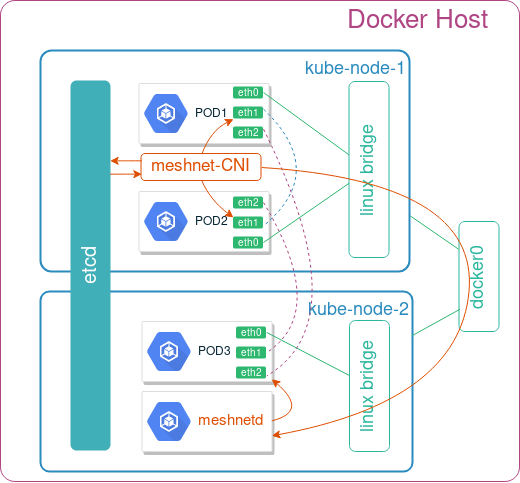

# meshnet CNI

**meshnet** is a (K8s) CNI plugin to create arbitrary network topologies out of point-to-point links with the help of [koko](https://github.com/redhat-nfvpe/koko). Heavily inspired by [Ratchet-CNI](https://github.com/dougbtv/ratchet-cni), [kokonet](https://github.com/s1061123/kokonet) and [Multus](https://github.com/intel/multus-cni).

## Architecture
The goal of this plugin is to interconnect pods via direct point-to-point links according to some pre-define topology. To do that, the plugin uses two types of links:
* **veth** - used to connect two pods running on the same host
* **vxlan** - used to connected two pods running on different hosts

Topology information, represented as a list of links per pod, is stored in a private etcd cluster in the following format:

```json /pod2/links
[ {  "uid":            21,
     "peer_pod":     "pod3",
     "local_intf":   "eth2",
     "local_ip":     "23.23.23.2/24",
     "peer_intf":    "eth2",
     "peer_ip":      "23.23.23.3/24" }]
```

The plugin configuration file specifies the connection details of the private etcd cluster, as well as the `delegate` plugin configuration, which will setup the first (`eth0`) interface of the pod.

```yaml
{
  "cniVersion": "0.1.0",
  "name": "my_network",       <--- Arbitrary name
  "type": "meshnet",          <--- The name of CNI plugin binary
  "etcd_host": "10.97.209.1", <--- IP address of etcd service 
  "etcd_port": "2379",
  "delegate": {               <--- Plugin responsible for the first interface (eth0)
    "name": "dind0",
    "bridge": "dind0",
    "type": "bridge",
    "isDefaultGateway": true,
    "ipMasq": true,
    "ipam": {
      "type": "host-local",
      "subnet": "10.244.1.0/24",
      "gateway": "10.244.1.1"
    }
  }
}
```

The plugin consists of three main components:

* **etcd** - a private cluster storing topology information and runtime pod metadata (e.g. pod IP address and NetNS)
* **meshnet** - a CNI binary reponsible for pod's network configuration
* **meshnetd** - a daemon reponsible for Vxlan link configuration updates



Below is the order of operation of the plugin from the perspective of kube-node-1:

1. `etcd` cluster gets populated with the topology information
2. pod-1/pod-2 come up, local kubelet calls the `meshnet` binary for each pod to setup their networking
3. meshnet binary `delegates` the ADD command to the "master" plugin specified in the CNI configuration file, which connectes interface `eth0`
  > Note that `eth0` is **always** setup by one of the existing CNI plugins. It is used to provide external connectivity to and from the pod
4. meshnet binary updates the etcd cluster with pod's metadata (namespace filepath and primary IP address)
5. meshnet binary retrieves the list of `links` and looks up peer pod's metadata in etcd to compare its own IP address to the primary IP address of each peer
6. If the peer is on the same node, it calls koko to setup a `veth` link between the two pods
7. If the peer is on the remote node, it does two things:  
    7.1 It calls koko to setup a local `vxlan` link  
    7.2 It makes an `HTTP PUT` call to the remote node's meshnet daemon, specifying this link's metadata (e.g. VTEP IP and VNI)
8. Upon receipt of this information, remote node's `meshnetd` idepmotently updates the local vxlan link, i.e. it creates a new link, updates the existing link if there's a change or does nothing if the link attributes are the same.


## Local Demo

> Note: go 1.11 or later is required

Clone this project and build a local dind 3-node kubernetes cluster

```
./reinit.sh
```

Deploy the private etcd cluster

```
export PATH="$HOME/.kubeadm-dind-cluster:$PATH"
kubectl create -f utils/etcd.yml
```

Build `meshnet` and `meshnetd`. The scripts also builds a Docker image and requires a dockerhub username to be provided to push the image to the docker hub.

> Note: the first time the command runs, it pulls down all the dependencies specified in `go.mod`, which may take a few  minutes to complete

```
./build.sh <dockerhub_username>
```


Deploy meshnet plugin

```
kubectl create -f kube-meshnet.yml
```

Upload the topology information to etcd cluster (in this case 3 pods connected as triangle)

```
tests/upload-topology.sh
```

Create 3 test pods (2 pods on 1 node and 1 pod on another)

```
cat tests/2node.yml | kubectl create -f -
```

Check that all pods are running

```
kubectl --namespace=default get pods -o wide  |  grep pod
pod1                                  1/1       Running   0          3m        10.244.2.31   kube-node-1
pod2                                  1/1       Running   0          3m        10.244.2.32   kube-node-1
pod3                                  1/1       Running   0          3m        10.244.1.15   kube-master
```

Test connectivity between pods

```
kubectl exec pod1 -- sudo ping -c 1 12.12.12.2
kubectl exec pod2 -- sudo ping -c 1 23.23.23.3
kubectl exec pod3 -- sudo ping -c 1 13.13.13.1
```

Destroy 3 test pods

```
cat tests/2node.yml | kubectl delete --grace-period=0 --force -f -
```


## Installation

### Generic instructions

The following instructions are executed from a node with kubectl access to kubernetes cluster.

#### Step 1 - Install private etcd cluster

```
kubectl create -f utils/etcd.yml
```

#### Step 2 - Install meshnet CNI plugin

```
kubectl create -f kube-meshnet.yml
```

#### Step 3 - Update CNI configuration file

Meshnet CNI configuration file requires two updates. 

```
{
  "cniVersion": "0.1.0",
  "name": "meshnet_network",
  "type": "meshnet",
  "etcd_host": "10.103.144.119",   <-- Update 2
  "etcd_port": "2379",
  "delegate": {}                   <-- Update 1
}
```

First, ensure that the `delegate` key contains a valid CNI configuration of an existing plugin (e.g. bridge, flannel, weave). The following is an example for flannel:

```
  "delegate": {
    "type": "flannel",
    "name": "flannel_network",
    "delegate": {
      "forceAddress": true,
      "hairpinMode": true,
      "isDefaultGateway": true
    }
  }
```

Second, update etcd host to point to the previously deployed etcd cluster. The following command shows a Cluster-IP for etcd-client service:

```
$ kubectl get service etcd-client
NAME          TYPE       CLUSTER-IP       EXTERNAL-IP   PORT(S)          AGE
etcd-client   NodePort   10.103.144.119   <none>        2379:32379/TCP   15m
```

### Kubespray instructions

#### (Optional) Step 1 - Install 4-node K8s cluster using Kubespray

These instructions will install k8s with flannel as default CNI plugin and allow any insecure Docker registries.

```
git clone https://github.com/kubernetes-incubator/kubespray.git &&  cd kubespray

sudo pip install -r requirements.txt

cp -rfp inventory/sample/ inventory/mycluster

declare -a IPS=(10.83.30.251 10.83.30.252 10.83.30.253 10.83.30.254)

CONFIG_FILE=inventory/mycluster/hosts.ini python3 contrib/inventory_builder/inventory.py ${IPS[@]}

sed -i 's/calico/flannel/g' inventory/mycluster/group_vars/k8s-cluster/k8s-cluster.yml

echo -e "docker_insecure_registries:\n   - 0.0.0.0/0" >> inventory/mycluster/group_vars/all/docker.yml

ansible-playbook -i inventory/mycluster/hosts.ini --become --become-user=root -u core cluster.yml
```

#### Step 2 - Install hosted meshnet service on top of K8s cluster

```
cp inventory/mycluster/hosts.ini ~/meshnet-cni/kubespray/ && cd ~/meshnet-cni/kubespray/
./build.sh
```

#### (Optional) Step 3 - Use k8s-topo to orchestrate network topologies

Login the K8s master node and

```
git clone https://github.com/networkop/k8s-topo.git && cd k8s-topo
```

Deploy k8s-topo pod

```
kubectl create -f kube-k8s-topo.yml
```

Login the k8s-topo pod

```
kubectl exec -it k8s-topo sh
```

Create a random 20-node network topology

```
./examples/builder/builder 20 0
Total number of links generated: 19
```

Create the topology inside K8s

```
./bin/k8s-topo --create examples/builder/random.yml 
```

Optionally, you can generate a D3.js network topology graph 

```
./bin/k8s-topo --graph examples/builder/random.yml 
```

View the generated topology graph at `http://<any_k8s_cluster_node_ip>:32080`

Verify that the topology has been deployed (from the master node)

```
kubectl get pods -o wide | grep qrtr
qrtr-1     1/1     Running   0          11s     10.233.65.231   node3   <none>
qrtr-10    1/1     Running   0          11s     10.233.65.234   node3   <none>
qrtr-11    1/1     Running   0          10s     10.233.66.246   node4   <none>
```

Login the first node and verify connectivity to every other loopback 

```
$ qrtr-1
/ # for i in `seq 1 20`; do ping -c 1 -W 2 198.51.100.$i|grep from; done
64 bytes from 198.51.100.1: seq=0 ttl=64 time=0.052 ms
64 bytes from 198.51.100.2: seq=0 ttl=58 time=0.428 ms
64 bytes from 198.51.100.3: seq=0 ttl=63 time=0.274 ms
64 bytes from 198.51.100.4: seq=0 ttl=62 time=0.271 ms
64 bytes from 198.51.100.5: seq=0 ttl=58 time=0.528 ms
64 bytes from 198.51.100.6: seq=0 ttl=58 time=0.560 ms
64 bytes from 198.51.100.7: seq=0 ttl=59 time=0.502 ms
64 bytes from 198.51.100.8: seq=0 ttl=57 time=0.470 ms
64 bytes from 198.51.100.9: seq=0 ttl=57 time=0.564 ms
64 bytes from 198.51.100.10: seq=0 ttl=61 time=0.267 ms
64 bytes from 198.51.100.11: seq=0 ttl=56 time=0.544 ms
64 bytes from 198.51.100.12: seq=0 ttl=63 time=0.280 ms
64 bytes from 198.51.100.13: seq=0 ttl=62 time=0.358 ms
64 bytes from 198.51.100.14: seq=0 ttl=61 time=0.380 ms
64 bytes from 198.51.100.15: seq=0 ttl=64 time=0.154 ms
64 bytes from 198.51.100.16: seq=0 ttl=60 time=0.379 ms
64 bytes from 198.51.100.17: seq=0 ttl=59 time=0.356 ms
64 bytes from 198.51.100.18: seq=0 ttl=59 time=0.307 ms
64 bytes from 198.51.100.19: seq=0 ttl=60 time=0.260 ms
64 bytes from 198.51.100.20: seq=0 ttl=58 time=0.466 ms
```

Destroy the topology

```
./bin/k8s-topo --destroy examples/builder/random.yml 
```


## Troubleshooting

Each POD is supposed to run an `init-wait` container that waits for the right number of interface to be connected before passing the ball to the main container. However, sometimes, PODs restart resulting in the missing interfaces inside the main container process, since they may have been added *AFTER* the process that reads the container interface list (e.g. qemu-kvm for VM-based containers). This is the procedure I use to identify the cause of the failure:

1. Identify which POD is at fault. This will most likely be the incorrect number of interfaces.
2. Identify which interface is missing or was added last.
3. Identify the correlation between the pair of containers interconnected by the missing interface
4. Look for the peer container's failures using `kubectl get events --sort-by=.metadata.creationTimestamp'`
5. Identify which k8s node this POD is running on `kubectl get pods  zhfer-scs1001-a -o yaml  | grep node`
6. On that node check the `journalctl` for any errors associated with the POD