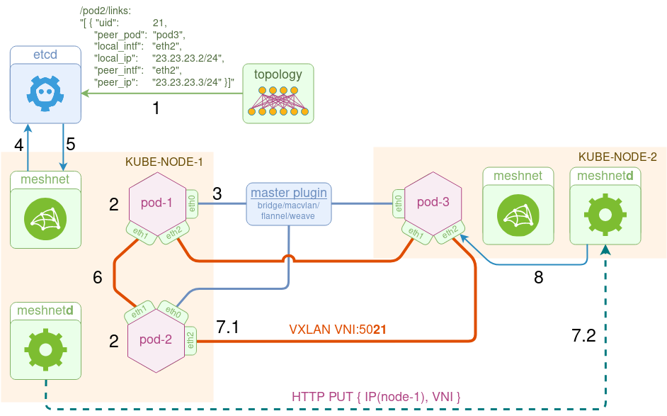

# meshnet CNI

**meshnet** is a (K8s) CNI plugin to create arbitrary network topologies out of point-to-point links with the help of [koko](https://github.com/redhat-nfvpe/koko). Heavily inspired by [Ratchet-CNI](https://github.com/dougbtv/ratchet-cni), [kokonet](https://github.com/s1061123/kokonet) and [Multus](https://github.com/intel/multus-cni).

## Architecture
The goal of this plugin is to interconnect pods via direct point-to-point links according to some pre-define topology. To do that, the plugin uses two types of links:
* **veth** - used to connect two pods running on the same host
* **vxlan** - used to connected two pods running on different hosts

Topology information, represented as a list of links per pod, is stored in a private etcd cluster in the following format:

```json /pod2/links
[ {  "uid":            21,
     "peer_pod":     "pod3",
     "local_intf":   "eth2",
     "local_ip":     "23.23.23.2/24",
     "peer_intf":    "eth2",
     "peer_ip":      "23.23.23.3/24" }]
```

The plugin configuration file specifies the connection details of the private etcd cluster, as well as the `delegate` plugin configuration, which will setup the first (`eth0`) interface of the pod.

```yaml
{
  "cniVersion": "0.1.0",
  "name": "my_network",       <--- Arbitrary name
  "type": "meshnet",          <--- The name of CNI plugin binary
  "etcd_host": "10.97.209.1", <--- IP address of etcd service 
  "etcd_port": "2379",
  "delegate": {               <--- Plugin responsible for the first interface (eth0)
    "name": "dind0",
    "bridge": "dind0",
    "type": "bridge",
    "isDefaultGateway": true,
    "ipMasq": true,
    "ipam": {
      "type": "host-local",
      "subnet": "10.244.1.0/24",
      "gateway": "10.244.1.1"
    }
  }
}
```

The plugin consists of three main components:

* **etcd** - a private cluster storing topology information and runtime pod metadata (e.g. pod IP address and NetNS)
* **meshnet** - a CNI binary reponsible for pod's network configuration
* **meshnetd** - a daemon reponsible for Vxlan link configuration updates



Below is the order of operation of the plugin from the perspective of kube-node-1:

1. `etcd` cluster gets populated with the topology information
2. pod-1/pod-2 come up, local kubelet calls the `meshnet` binary for each pod to setup their networking
3. meshnet binary `delegates` the ADD command to the "master" plugin specified in the CNI configuration file, which connectes the first, **eth0** interface
4. meshnet binary updates the etcd cluster with pod's metadata (namespace filepath and primary IP address)
5. meshnet binary retrieves the list of `links` and looks up peer pod's metadata in etcd to compare its own IP address to the primary IP address of each peer
6. If the peer is on the same node, it calls koko to setup a `veth` link between the two pods
7. If the peer is on the remote node, it does two things:  
    7.1 It calls koko to setup a local `vxlan` link  
    7.2 It makes an `HTTP PUT` call to the remote node's meshnet daemon, specifying this link's metadata (e.g. VTEP IP and VNI)
8. Upon receipt of this information, remote node's `meshnetd` idepmotently updates the local vxlan link, i.e. it creates a new link, updates the existing link if there's a change or does nothing if the link attributes are the same.


## Demo

> Note: go 1.11 or later is required

Clone this project and:

```
go build ./...
```

Build a local dind 2-node kubernetes cluster

```
./reinit.sh
```

Deploy the private etcd cluster

```
export PATH="$HOME/.kubeadm-dind-cluster:$PATH"
kubectl create -f utils/etcd.yml
```

Build `meshnet`, `meshnetd` and copy them along with the CNI configuration file to all mebers of the cluster. The scripts requires dockerhub username to be provided to push the `meshnetd` image

```
./build.sh <dockerhub_username>
```

Upload the topology information to etcd cluster (in this case 3 pods connected as triangle)

```
tests/upload-topology.sh
```

Create 3 test pods (2 pods on 1 node and 1 pod on another)

```
cat tests/2node.yml | kubectl create -f -
```

Check that all pods are running

```
kubectl --namespace=default get pods -o wide  |  grep pod
pod1                                  1/1       Running   0          3m        10.244.2.31   kube-node-1
pod2                                  1/1       Running   0          3m        10.244.2.32   kube-node-1
pod3                                  1/1       Running   0          3m        10.244.1.15   kube-master
```

Test connectivity between pods

```
kubectl exec pod1 -- sudo ping -c 1 12.12.12.2
kubectl exec pod2 -- sudo ping -c 1 23.23.23.3
kubectl exec pod3 -- sudo ping -c 1 13.13.13.1
```

Destroy 3 test pods

```
cat tests/2node.yml | kubectl delete --grace-period=0 --force -f -
```
