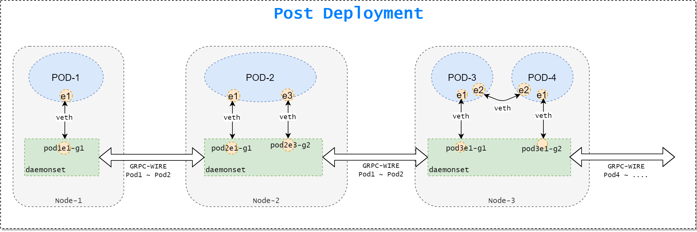
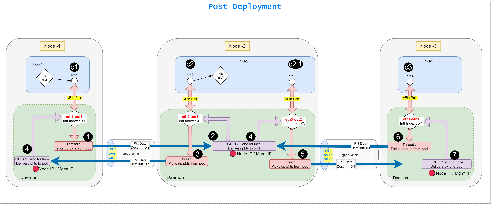

# TLDR ;

In K8S usually pods across nodes are connected using VxLAN/IPnIP/GRE overlay. Our objective is to connect these pods  over grpc. This provides point to point wire using grpc. One of the advantages, that is leveraged right now , is no reduction of MTU. For example adding VXLAN will reduce virtual interface MTU by 20 bytes. This will not be the case with grpc-wire, Virtual interface MTU remain 1500 (or can be made higher - not tried yet.)

Let's take an example CRD as given in the picture below  


When this crd is deployed with grpc-wire CNI, then the nodes across the K8S pods will interact over a grpc channel. Each grpc channel will provide a point to point connection between pods.  For example POD-1:e1 ~~ POD-2:e1 will be a dedicated grpc channel for POD1 & POD-2 communication via their 'e1' virtual interfaces.   



Each node in the cluster runs a CNI daemon set. This daemon in the node is responsible to maintain the GRPC channel and sending and receiving packets over it. In a node, each pod is connected with the node daemon using a veth-pair. One end of the veth pair is inside the pod and the other end is with the daemon. Pods always writes/reads from the the interface it has got. Whereas the daemon is always listening on the other end of the veth pair. As soon as the pod writes a packet, the daemon gets it and transports it over the grpc channel to the remote node. Daemon in the remote node delivers it to the destination pod.   
  
**This is TLDR; no more details in this section.**  


# Details :-

When a pod wants to send a packet to a remote pod, it writes it on the interface inside the pod. Pod is completely unaware of the grpc overlay being used.  The interface that a pod sees is one end of a veth pair. The other end of the veth pair is with meshnet daemon. The meshnet daemon receives any packet that a pod wants to send. Meshnet daemon uses the following proto to deliver the packet to the destination pod (on a different node).  

```go    
message Packet {
    int64 remot_intf_id = 1;   //remote machine interface id, to which packets to be delivered. 
    bytes frame = 2;           //raw bytes
    int64 frame_len = 3;       //packet length
}
```

The packet itself carries the id of the destination interface. Destination interface is a interface in the remote node and the meshnet daemon in the remote machine has access to this interface. This destination interface is one end of the veth pair and the other end of this veth pair is within the  destination pod. This is ensured during the wire creation time. So when the packet reaches the destination daemon, the demon simply writes the received packet on the interface carried by the packet itself. Since it's a veth pair the packet goes to the destination pod which is connected at the other end. It avoids any per packet lookup and packet delivery becomes an O(1) operation. 

Overall Tx/Rx mechanism is depicted in the picture below. 




